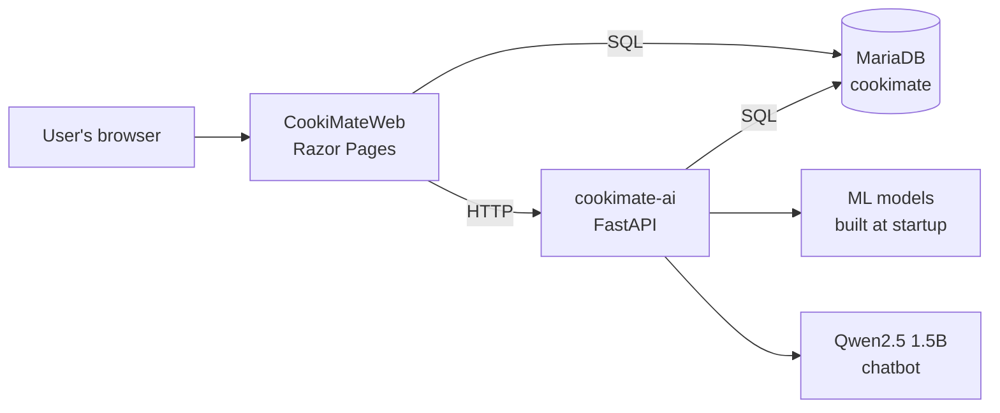

# CookiMate

A recipe recommendation web app that helps people find recipes they will actually like, based on what they search for, the ingredients they prefer, their diet, and their allergies.

Built as a final-year project, using ASP.NET Core Razor Pages for the website and a separate FastAPI service for the AI and machine learning parts.

## Features

- **Recipe search** that searches within the group (cluster) of recipes most related to user's query.
- **Personal recommendations** based on the recipes user rated and saved as favorites.
- **Allergen detection** that tags each recipe automatically when it is uploaded, using the US FDA "big 9" allergens (peanut, tree nut, shellfish, fish, egg, dairy, soy, gluten, sesame).
- **Saved food preferences** (diet, allergens to avoid, disliked ingredients) applied automatically on the Home, Search and Recommend pages.
- **Cooking assistant chatbot** that understands requests like "something quick with chicken" and turns them into search filters. A small local AI model helps when the rule-based parser can't understand the message.
- **Duplicate recipe check** on upload, so the same recipe isn't added twice.
- **Calorie filter, meal plans, favorites, reviews and recipe uploads**, plus an admin page to approve and manage recipes.

## Tech stack

| Part | Technology |
|---|---|
| Website | ASP.NET Core 8 Razor Pages (C#), Tailwind CSS |
| AI service | FastAPI (Python 3.12) |
| Machine learning | scikit-learn (TF-IDF, TruncatedSVD), UMAP, HDBSCAN |
| Chatbot model | Qwen2.5-1.5B-Instruct (GGUF, Q4_K_M) via llama-cpp-python, runs on CPU |
| Database | MariaDB 10.4 (XAMPP) |
| Passwords | BCrypt hashing |


## How it fits together


The website handles pages, accounts and saving data. It calls the AI service for search, recommendations, chatbot messages and allergen tagging. The AI service builds its models from the database when it starts, and rebuilds them every night at 02:00.


## Project structure

```
CookiMateSource/
├── cookimate-ai/            # FastAPI AI service (Python)
│   ├── main.py              # App startup, health check
│   ├── search.py            # Search endpoint and ranking
│   ├── recommendations.py   # Recommendation endpoint
│   ├── guidance.py          # Chatbot parsing
│   ├── llm_fallback.py      # Local Qwen model fallback
│   ├── allergen.py          # Allergen tagging endpoint
│   ├── model_cache.py       # Builds the ML pipeline
│   ├── db.py                # Database connection
│   ├── requirements.txt
│   └── .env.example
├── Pages/                   # Razor Pages (website)
├── Includes/                # Shared header and footer
├── wwwroot/                 # CSS, JS, images
├── CookiMateWeb.csproj
├── cookimate-ai.pyproj
└── CookiMateWeb.sln
```


## Getting started

### What you need

- Visual Studio 2026 (with the ASP.NET and Python workloads)
- .NET 8 SDK
- Python 3.12
- XAMPP (MariaDB + phpMyAdmin)

### 1. Set up the database

1. Start MySQL in XAMPP and open phpMyAdmin.
2. Create a database called `cookimate` and import `database/cookimate.sql`.
3. Create a database user for the app (don't use root):

```sql
CREATE USER 'cookimate_app'@'localhost' IDENTIFIED BY 'your_password';
CREATE USER 'cookimate_app'@'127.0.0.1' IDENTIFIED BY 'your_password';
GRANT SELECT, INSERT, UPDATE, DELETE ON cookimate.* TO 'cookimate_app'@'localhost';
GRANT SELECT, INSERT, UPDATE, DELETE ON cookimate.* TO 'cookimate_app'@'127.0.0.1';
```

### 2. Set up the AI service

```
cd cookimate-ai
py -3.12 -m venv .venv
.venv\Scripts\pip install -r requirements.txt
copy .env.example .env
```

Open `.env` and fill in your database user and password.

For the chatbot, download `qwen2.5-1.5b-instruct-q4_k_m.gguf` from Hugging Face ([Qwen/Qwen2.5-1.5B-Instruct-GGUF](https://huggingface.co/Qwen/Qwen2.5-1.5B-Instruct-GGUF)) and put it in `cookimate-ai/models/`. The app still runs without it, the chatbot just relies on the rule-based parser only.

### 3. Set up the website

In Visual Studio, right-click **CookiMateWeb**, then **Manage User Secrets**, and add:

```json
{
  "ConnectionStrings": {
    "DefaultConnection": "server=127.0.0.1;port=3306;database=cookimate;uid=cookimate_app;pwd=your_password;"
  }
}
```

### 4. Run

Open `CookiMateWeb.sln` and click **Run**. Both projects start together (the shared launch profile is included in the repo).

- Website: the address shown in the CookiMateWeb window
- AI service health check: http://127.0.0.1:8000/health
- AI service API docs: http://127.0.0.1:8000/docs
